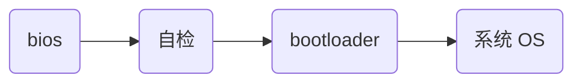
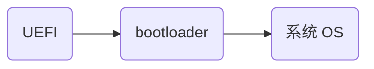

# Linux 基础

## 计算机组成

- 控制器（CPU）
- 运算器（ALU 逻辑运算单元）
- 存储器单元（RAM 随机存取内存器）
- 输入单元（键盘、鼠标等）
- 输出单元（屏幕、打印机等）

## 操作系统

管理系统资源，提供接口（如播放音频其实是调用操作系统提供的接口，操作系统再控制硬件使其发出声音），操作系统起到承上（软件）启下（硬件）的作用。

### 操作系统启动流程

操作系统启动分为两种，分为：

下面的方式是上面方式的升级版，优化了载入速度，允许引导 2Tb 以上的磁盘以启动系统。

推荐文章：

- [浅谈操作系统-启动过程](https://zhuanlan.zhihu.com/p/32280478)
- [bios 详解](https://www.cnblogs.com/vinozly/p/5877005.html)

## Linux 基本组成

- Linux 内核：提供底层接口，在 Linux 内核之上构建诸多发行版本，如 `Debian`，又在不同的发行版上开发不同的操作系统，如 `Ubuntu OS` 基于 `Debian` 开发。

- shell：Linux 内核提供的接口，用于与 Linux 内核交互，推荐阅读：[Shell 是什么？1 分钟理解 Shell 的概念！](http://c.biancheng.net/view/706.html)
- 文件系统：Linux 将一切都看作文件，包括硬件设备，文件系统就是对它们进行管理，推荐阅读：[Linux 文件系统详解](https://blog.csdn.net/yuexiaxiaoxi27172319/article/details/45241923)
- 应用程序：为完成某项或多项特定工作的计算机程序。

## Linux 体系结构

- 用户空间

  - 应用程序
  - glibc：程序运行时使用到的一些 API，配合 Linux 内核

- 内核空间

  - 系统调用
  - 内核
    - 系统调用接口
    - 进程管理、内存管理
    - 虚拟文件系统、网络堆栈
    - 设备驱动
  - 平台架构相关代码

内核空间与用户空间相互隔离，提高了安全性，利于权限控制。

### Linux 上下文切换

内核态可以直接访问所有资源，用户态只能访问部分资源；用户态需要访问特权资源时，CPU 将上下文从用户态切换至内核态，由内核态完成。

推荐阅读：

- [深入理解 Linux 的 CPU 上下文切换](https://cloud.tencent.com/developer/article/1897179)

## 进程

进程是正在运行的一个程序或任务，拥有自己的独立内存空间，一个 CPU 内核同一时间只能运行一个进程，进程拥有自己的 id（PID）与父进程的 id（PPID）。

推荐阅读：

- [什么是进程](https://zhuanlan.zhihu.com/p/106283969)

- [Linux 创建子进程执行任务 ](https://www.cnblogs.com/sparkdev/p/8214455.html)

### 进程调度

进程调度指 CPU 根据某种策略来决定执行哪个任务，比如会先执行高优先级的任务。

进程调度遵循一定原则：

- 一个 CPU 同一时间只能运行一个进程
- 每个进程的等待时间是近似的
- 逻辑 CPU 使用轮询的方式进行进程调度，轮询完成则回到第一个进程反复
- 进程执行消耗时间与进程量成正比

## 文件系统

文件系统是操作系统中管理持久数据的子系统，文件系统将文件分为不同的类型：

- ext2/ext3/ext4：普通文件
- nfs：网络文件
- proc、sysfs：虚拟文件

### VFS 虚拟文件系统

提供文件和文件系统操作的统一接口，屏蔽不同文件系统的差异和操作细节。借助 VFS 可以直接使用 `open()`、`read()`、`write()` 这样的系统调用操作文件，而无须考虑具体的文件系统和实际的存储介质。

VFS 抽象了一个通用的文件系统模型，定义了通用文件系统都支持的、概念上的接口。新的文件系统只要支持并实现这些接口，并注册到 Linux 内核中，即可安装和使用。

推荐阅读：

- [浅谈 Linux 虚拟文件系统](https://zhuanlan.zhihu.com/p/69289429)

## 用户权限

- 用户账户
  - 普通用户账户：在系统中进行普通作业
  - 超级用户账户：在系统中管理整个系统与普通用户
- 组账户
  - 标准组：可以容纳多个用户
  - 私有组：只有用户自己

## 文件权限

文件权限分为 读（R）、写（W）、执行（X），每个用户对于相同的文件可能有不同的权限。

文件权限与用户相关的概念有：

- 所有者：文件所有者，即某个用户
- 所在组：用户所在的组
- 其他人：除所有者与所在组外的其他用户

## 软件包 & 软件包管理

软件包通常指一个应用程序，可以是一个 GUI 应用程序，也可以是命令行工具或软件库。

软件包管理分为底层工具和上层工具：

- 底层工具：处理安装或删除软件包等任务
- 上层工具：数据搜索和依赖解析

> ByteTech 青训营
